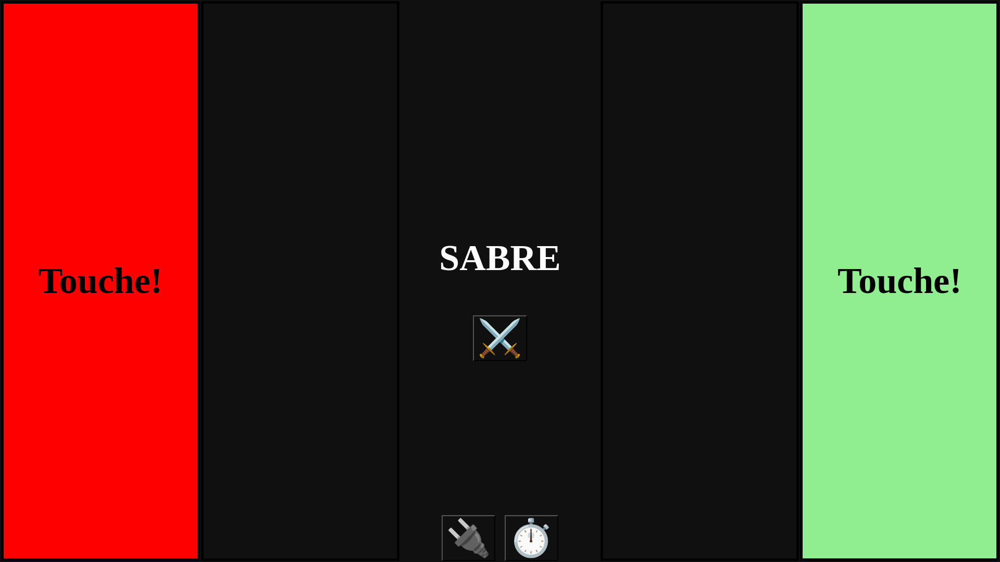

Frontend application to display/control the fencing score board
===============================================================

The application allows to display information coming from a Fencing Score Board "L'arbitre de touche", and to control some of its behavior.

It currently supports
* Showing on a computer screen
  * Current weapon
  * Lights for hits
* Control to switch weapon
* Passing/reading timing configuration
* Control to choosing the board to connect with
* (Non-functional yet) control to configure timings

We hope to add support for
* Provide assistance in choosing a board to connect to
* targeting mobile device (eg Android) with eg. a Cordova package

## Technologies

* HTML, JS for rendering
* serialport-node for Serial connection
* Electron for packaging as application ()

## Test it

* From this source folder, run `npm install`, then
* Run `electron main.js`